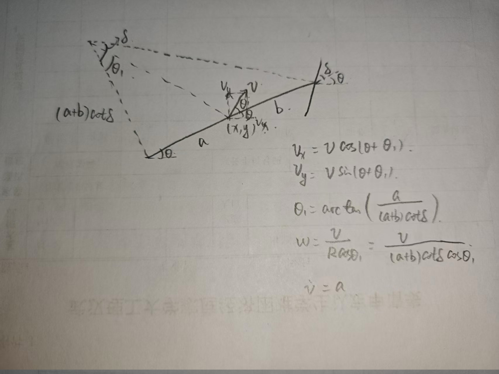
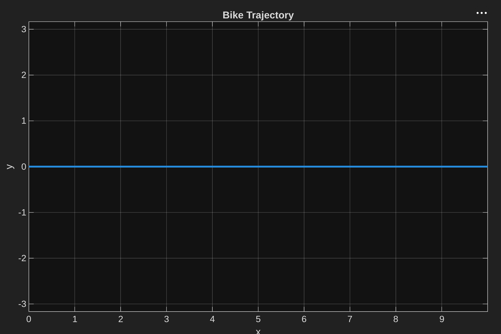
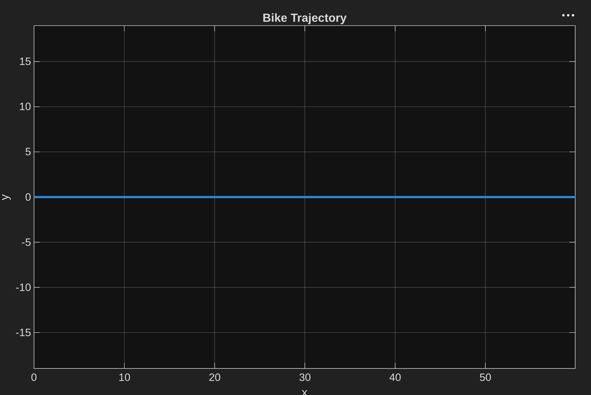
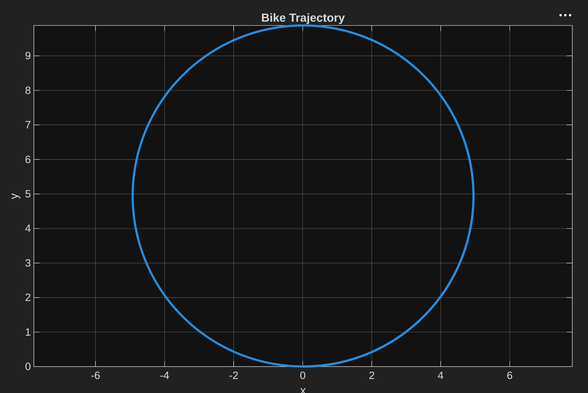
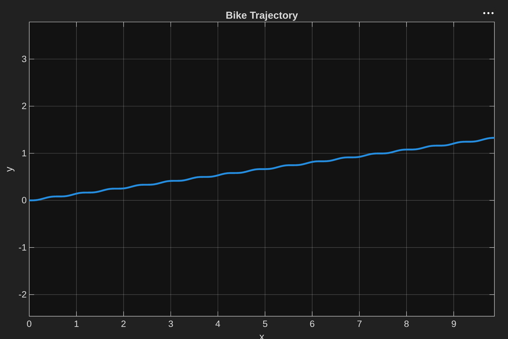

# 自行车数字孪生控制系统

## 一、创建数学模型(MathModel)

### 1.建立自行车的状态向量

选取自行车的位置（x,y），速度（v），朝向（$\theta$）作为状态变量，选取加速度(a),前轮转向($\delta$)作为控制量。

### 2.推导状态方程
推导运动方程如下：

$$
\frac{d}{dt}
\begin{bmatrix}
x \\
y \\
v \\
\theta
\end{bmatrix}
=
\begin{bmatrix}
v\cos(\theta + \arctan(\frac{a}{(a+b)\cot\delta})) \\
v\sin(\theta + \arctan(\frac{a}{(a+b)\cot\delta})) \\
a \\
\frac{v\cos(\arctan(\frac{a}{(a+b)\cot\delta}))}{(a+b)\cot\delta}
\end{bmatrix}
$$

选取自行车轨迹作为观测量，即：

$$
\vec{y} = \begin{bmatrix} 1 & 1 & 0 & 0 \end{bmatrix}
\begin{bmatrix}
x \\
y \\
v \\
\theta
\end{bmatrix}
$$

### 3.验证数学模型
当v = 1时，其他状态变量和控制量为零，获得轨迹如下：

当v = 1，a = 1时，轨迹如下：

可以看见符合运动学规律。
当v = 1，a = 1， delta = 0.2时，轨迹如下:

当v = 1，delta = sin(0.1t)时，轨迹如下：


## 二、创建ROS节点(BikeTwinNode)

采用话题发布订阅的方式，将上一步数学模型的结果当成Topic发布，消息格式为
```bash
header:
  stamp:
    sec: 1784286452
    nanosec: 118656228
  frame_id: world
pose:
  position:
    x: 40.77479543964176
    y: 48.81209709699248
    z: 0.0
  orientation:
    x: 0.0
    y: 0.0
    z: -0.7030888295960607
    w: -0.7111020304409498
twist:
  linear:
    x: 10.994126714392971
    y: 50.33057352306909
    z: 0.0
  angular:
    x: 0.0
    y: 0.0
    z: -10.423064872779396
---
```
包含时间戳，坐标系，位置,朝向和速度。

## 三、ROS节点与Unity通信

### 1.从ros_tcp_endpoint仓库中下载编译ros包
```bash
mkdir -p ros2_ws/src
cd ./src
git clone -b main-ros2 https://github.com/Unity-Technologies/ROS-TCP-Endpoint.git
cd ..
rosdep install --from-paths src --ignore-src -r -y
colcon build --packages-select ros_tcp_endpoint
```
### 2.在ubuntu中使用这个ros包
```bash
cd ros2_ws/
source install/setup.bash
ros2 run ros_tcp_endpoint default_server_endpoint
```
此时在电脑本地端口127.0.0.1：10000会采用TCP协议通信，在Unity中下载对应的ROS-TCP-Connector，监听本地端口数据，就可以进行相互通信。此时用发送的数据就可以让Unity中的模型动起来。


